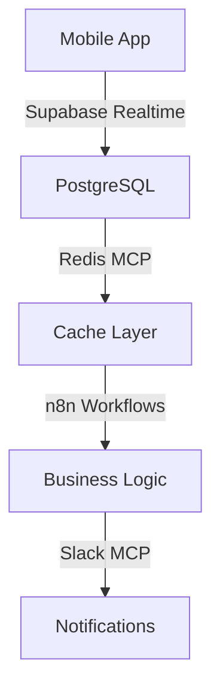

# 🤖 MCP Tools Integration

## Overview

The Instabids mobile app leverages an extensive suite of MCP (Model Context Protocol) tools to enable AI-powered development, automated workflows, and seamless integrations. This document provides a comprehensive guide to all MCP tools used in the project.

## Complete MCP Tool Stack (17 Tools)

### 1. Design & Development Tools

#### 🎨 Figma Integration (4 Tools)

##### a) **figma-dev-mode**
- **Type**: SSE (Server-Sent Events)
- **Purpose**: Official Figma Dev Mode integration
- **Features**:
  - Direct access to Figma's Dev Mode
  - Code Connect integration
  - Real-time design updates
  - Component property extraction
- **Configuration**:
  ```json
  {
    "type": "sse",
    "url": "http://127.0.0.1:3845/mcp"
  }
  ```

##### b) **claude-talk-to-figma**
- **Type**: WebSocket + Plugin
- **Purpose**: Real-time design manipulation
- **Features**:
  - Create/modify designs programmatically
  - Batch operations
  - Live selection tracking
- **Port**: 3055

##### c) **figma-developer**
- **Type**: npm package
- **Purpose**: AI-optimized code generation
- **Features**:
  - Cursor-optimized workflows
  - Component extraction
  - Asset downloading

##### d) **figma-comprehensive**
- **Type**: npm package
- **Purpose**: Full Figma API access
- **Features**:
  - Complete API coverage
  - Webhook management
  - Analytics access

#### 🏗️ **Builder.io Visual Copilot**
- **Purpose**: Figma to React Native code generation
- **Features**:
  - 75% accuracy rate
  - Mitosis compiler integration
  - Component mapping
  - Style preservation

### 2. Infrastructure & Backend Tools

#### 🗄️ **Supabase MCP**
- **Purpose**: Database and authentication management
- **Features**:
  - Schema management
  - Migration execution
  - Real-time subscriptions
  - RLS policy management
  - Branch deployments

#### 🐙 **GitHub MCP**
- **Purpose**: Version control automation
- **Features**:
  - Repository management
  - PR automation
  - Issue tracking
  - Workflow triggers
  - Code reviews

#### 🚀 **Vercel MCP**
- **Purpose**: Web deployment
- **Features**:
  - Automatic deployments
  - Preview environments
  - Edge functions
  - Analytics

#### 🌊 **DigitalOcean MCP**
- **Purpose**: Infrastructure management
- **Features**:
  - App Platform integration
  - Database clusters
  - Kubernetes management
  - Load balancers

#### 🔄 **n8n MCP**
- **Purpose**: Workflow automation
- **Features**:
  - 400+ integrations
  - Visual workflow builder
  - Webhook management
  - Scheduled tasks

#### 💬 **Slack MCP**
- **Purpose**: Team communication
- **Features**:
  - Deployment notifications
  - Error alerts
  - User feedback
  - Team updates

#### 🗃️ **Redis MCP**
- **Purpose**: Caching and real-time data
- **Features**:
  - Session management
  - Real-time bid tracking
  - Leaderboards
  - Rate limiting

### 3. Development & Testing Tools

#### 📱 **Expo Application Services (EAS)**
- **Purpose**: Build and deployment
- **Features**:
  - Cross-platform builds
  - OTA updates
  - Native module support
  - Submission automation

#### 🏃 **Codemagic MCP**
- **Purpose**: CI/CD pipeline
- **Features**:
  - Apple Silicon M2/M4 machines
  - Parallel builds
  - Test automation
  - Release management

#### 🧪 **BrowserStack MCP**
- **Purpose**: Real device testing
- **Features**:
  - 20,000+ real devices
  - Percy visual testing
  - Automated test runs
  - Performance metrics

#### 🔬 **Detox MCP**
- **Purpose**: E2E testing
- **Features**:
  - Grey-box testing
  - React Native optimized
  - CI integration
  - Visual regression

#### 🚢 **Fastlane MCP**
- **Purpose**: App store deployment
- **Features**:
  - 400+ actions
  - Screenshot automation
  - Metadata management
  - Beta distribution

### 4. Cloud & Infrastructure Tools

#### ☁️ **GCP MCP**
- **Purpose**: Google Cloud services
- **Features**:
  - Firebase integration
  - Cloud Functions
  - ML services
  - Analytics

## Integration Workflows

### Design to Deployment Pipeline

```mermaid
graph LR
    A[Figma Design] -->|figma-dev-mode| B[Extract Components]
    B -->|Builder.io| C[Generate React Native Code]
    C -->|GitHub MCP| D[Commit Code]
    D -->|Codemagic| E[Run Tests]
    E -->|BrowserStack| F[Device Testing]
    F -->|EAS Build| G[Create Builds]
    G -->|Fastlane| H[Deploy to Stores]
    H -->|Vercel| I[Deploy Web Version]
```



### Real-time Data Flow



## Configuration Examples

### Complete MCP Configuration

```json
{
  "mcpServers": {
    "figma-dev-mode": {
      "type": "sse",
      "url": "http://127.0.0.1:3845/mcp"
    },
    "claude-talk-to-figma": {
      "command": "bunx",
      "args": ["claude-talk-to-figma-mcp@latest"]
    },
    "figma-developer": {
      "command": "npx",
      "args": [
        "-y", 
        "figma-developer-mcp", 
        "--figma-api-key=YOUR_KEY",
        "--stdio"
      ]
    },
    "supabase": {
      "command": "cmd",
      "args": [
        "/c",
        "npx",
        "-y",
        "@supabase/mcp-server-supabase@latest",
        "--access-token",
        "YOUR_TOKEN"
      ]
    },
    // ... other tools
  }
}
```

## Usage Examples

### 1. Create Component from Figma

```typescript
// Using figma-dev-mode to extract component
const component = await figma.getComponent('component-key');

// Using Builder.io to generate React Native code
const code = await builderIO.generateReactNative(component);

// Using GitHub MCP to create PR
await github.createPullRequest({
  title: 'Add new component from Figma',
  body: 'Generated from Figma design',
  files: [{ path: 'src/components/NewComponent.tsx', content: code }]
});
```

### 2. Deploy Update

```typescript
// Using EAS to create update
const update = await eas.createUpdate({
  branch: 'production',
  message: 'Fix critical bug'
});

// Using Slack MCP to notify team
await slack.postMessage({
  channel: '#deployments',
  text: `New update deployed: ${update.id}`
});
```

### 3. Run Automated Tests

```typescript
// Using Detox for E2E tests
const results = await detox.runTests({
  configuration: 'ios.sim.release',
  suite: 'critical-path'
});

// Using BrowserStack for device testing
if (results.passed) {
  await browserstack.runTests({
    devices: ['iPhone 14', 'Pixel 7'],
    suite: 'smoke-tests'
  });
}
```

## Best Practices

### 1. Tool Selection
- Use `figma-dev-mode` for official integration
- Use `claude-talk-to-figma` for real-time editing
- Use `Builder.io` for code generation
- Use `Supabase` for all database operations

### 2. Automation Strategies
- Chain MCP tools for complex workflows
- Use webhooks for event-driven automation
- Implement retry logic for reliability
- Log all operations for debugging

### 3. Security Considerations
- Store API keys in environment variables
- Use minimal permissions for each tool
- Rotate tokens regularly
- Audit tool access logs

## Troubleshooting

### Common Issues

1. **Figma Connection Issues**
   - Ensure Figma Desktop is running
   - Check WebSocket port availability
   - Verify API token permissions

2. **Build Failures**
   - Check EAS build logs
   - Verify native dependencies
   - Clear build cache

3. **Test Failures**
   - Review BrowserStack recordings
   - Check Detox synchronization
   - Verify test data state

## Resources

- [MCP Protocol Specification](https://github.com/anthropics/mcp)
- [Figma API Documentation](https://www.figma.com/developers/api)
- [Supabase Documentation](https://supabase.com/docs)
- [EAS Documentation](https://docs.expo.dev/eas/)

## Support

For MCP-related issues:
- Check tool-specific logs in `~/.claude/logs/`
- Join our Discord for community support
- Contact tool maintainers for specific issues