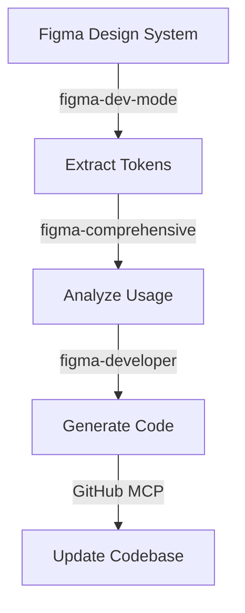

# 🎨 Figma MCP Integration Guide

## Overview

The Instabids project uses 4 different Figma MCP tools to create a comprehensive design-to-code pipeline. This guide explains how to use each tool and when to choose one over another.

## The 4 Figma MCP Tools

### 1. figma-dev-mode (Official Figma Integration)

**What it is**: Figma's official MCP server that runs inside Figma Desktop.

**Best for**:
- Accessing Dev Mode features
- Code Connect integration
- Design token extraction
- Component inspection

**Setup**:
1. Open Figma Desktop
2. Go to Preferences → Developer
3. Enable "Dev Mode MCP Server"
4. Server runs at `http://127.0.0.1:3845/mcp`

**Example Usage**:
```javascript
// Get component with Code Connect
const component = await figmaDevMode.getComponent({
  fileKey: 'abc123',
  nodeId: '1:2',
  includeCodeConnect: true
});

// Extract design tokens
const tokens = await figmaDevMode.getVariables({
  fileKey: 'abc123'
});
```

### 2. claude-talk-to-figma (Real-time Manipulation)

**What it is**: WebSocket-based tool for real-time design editing.

**Best for**:
- Creating designs programmatically
- Batch operations
- Live design updates
- Interactive workflows

**Setup**:
1. Import plugin to Figma
2. Run WebSocket server on port 3055
3. Connect plugin to server

**Example Usage**:
```javascript
// Create a new screen
await talkToFigma.createFrame({
  name: 'Login Screen',
  width: 390,
  height: 844
});

// Add components
await talkToFigma.createText({
  content: 'Welcome Back',
  fontSize: 32,
  fontWeight: 700
});

// Apply styling
await talkToFigma.setFillColor({
  color: { r: 0, g: 0, b: 0 }
});
```

### 3. figma-developer (AI-Optimized)

**What it is**: Cursor-optimized tool for AI-driven workflows.

**Best for**:
- Bulk asset extraction
- Component library analysis
- Code generation prep
- CI/CD integration

**Example Usage**:
```javascript
// Extract all components
const data = await figmaDeveloper.getFigmaData({
  fileKey: 'abc123',
  depth: 3
});

// Download all images
await figmaDeveloper.downloadFigmaImages({
  fileKey: 'abc123',
  nodes: data.images,
  localPath: './assets/images'
});
```

### 4. figma-comprehensive (Full API Access)

**What it is**: Complete Figma REST API wrapper.

**Best for**:
- Team management
- Webhook setup
- Comments/collaboration
- Analytics

**Example Usage**:
```javascript
// Set up webhook
await figmaComprehensive.createWebhook({
  event_type: 'FILE_UPDATE',
  team_id: 'team123',
  endpoint: 'https://api.instabids.com/figma-webhook'
});

// Get component usage analytics
const usage = await figmaComprehensive.getComponentUsage({
  fileKey: 'abc123',
  componentKey: 'button'
});
```

## Integrated Workflows

### Workflow 1: Design System Sync



### Workflow 2: Component Creation

```javascript
// Step 1: Create component in Figma
await talkToFigma.createFrame({ name: 'Button' });
await talkToFigma.createText({ content: 'Click Me' });
await talkToFigma.setAutoLayout({ 
  direction: 'horizontal',
  padding: { top: 12, right: 24, bottom: 12, left: 24 }
});

// Step 2: Extract with Dev Mode
const component = await figmaDevMode.getComponent({
  nodeId: 'created-node-id'
});

// Step 3: Generate React Native code
const code = `
import React from 'react';
import { TouchableOpacity, Text } from 'react-native';

export const Button = ({ onPress, children }) => (
  <TouchableOpacity 
    onPress={onPress}
    style={{
      paddingVertical: ${component.padding.vertical},
      paddingHorizontal: ${component.padding.horizontal},
      backgroundColor: '${component.fills[0].color}',
      borderRadius: ${component.cornerRadius}
    }}
  >
    <Text style={{ 
      fontSize: ${component.fontSize},
      color: '${component.textColor}' 
    }}>
      {children}
    </Text>
  </TouchableOpacity>
);
`;

// Step 4: Save to repository
await github.createFile({
  path: 'src/components/Button.tsx',
  content: code
});
```

### Workflow 3: Design Review Automation

```javascript
// Monitor design changes
const webhook = await figmaComprehensive.createWebhook({
  event_type: 'FILE_UPDATE',
  team_id: 'team123',
  endpoint: 'https://api.instabids.com/design-review'
});

// On webhook trigger
async function handleDesignUpdate(event) {
  // Get what changed
  const changes = await figmaDevMode.getFileVersions({
    fileKey: event.file_key,
    since: event.timestamp
  });
  
  // Extract affected components
  const components = await figmaDeveloper.getFigmaData({
    fileKey: event.file_key,
    nodeIds: changes.modified_nodes
  });
  
  // Create PR with updates
  await github.createPullRequest({
    title: `Design Update: ${changes.description}`,
    files: components.map(c => ({
      path: `src/components/${c.name}.tsx`,
      content: generateCode(c)
    }))
  });
}
```

## Design System Management

### Setting Up Design Tokens

```javascript
// Extract all design tokens
const tokens = await figmaDevMode.getVariables({
  fileKey: 'design-system-key'
});

// Transform to React Native
const theme = {
  colors: {},
  spacing: {},
  typography: {}
};

tokens.forEach(token => {
  switch(token.type) {
    case 'COLOR':
      theme.colors[token.name] = token.value;
      break;
    case 'FLOAT':
      if (token.name.includes('spacing')) {
        theme.spacing[token.name] = token.value;
      }
      break;
    case 'TEXT':
      theme.typography[token.name] = token.value;
      break;
  }
});

// Save theme file
await fs.writeFile(
  'src/theme/tokens.ts',
  `export const theme = ${JSON.stringify(theme, null, 2)}`
);
```

### Component Library Sync

```javascript
// Get all components from Figma
const components = await figmaComprehensive.getFileComponents({
  fileKey: 'component-library-key'
});

// For each component
for (const component of components) {
  // Get detailed info
  const details = await figmaDeveloper.getFigmaData({
    fileKey: 'component-library-key',
    nodeId: component.node_id
  });
  
  // Generate React Native component
  const code = await generateReactNativeComponent(details);
  
  // Save to file system
  await fs.writeFile(
    `src/components/${component.name}.tsx`,
    code
  );
}
```

## Plugin Installation Guide

### Required Figma Plugins

1. **Tokens Studio for Figma**
   - Manages design tokens
   - Syncs with code
   - [Install Link](https://www.figma.com/community/plugin/888356646278934516)

2. **Iconify**
   - 150,000+ icons
   - Searchable library
   - [Install Link](https://www.figma.com/community/plugin/735098390272716381)

3. **Content Reel**
   - Realistic data
   - User profiles, products, etc.
   - [Install Link](https://www.figma.com/community/plugin/731627216655469013)

4. **iOS 17 UI Kit**
   - Native iOS components
   - [Install Link](https://www.figma.com/community/file/1248375255495415511)

5. **Material 3 Design Kit**
   - Android components
   - [Install Link](https://www.figma.com/community/file/1035203688168086460)

### Plugin Setup Workflow

```bash
# 1. Install plugins in Figma
# 2. Create master design file
# 3. Run plugins to populate components
# 4. Share file key with MCP tools

# Example structure after plugin setup:
Design System/
├── 📁 Tokens (from Tokens Studio)
├── 📁 Icons (from Iconify)
├── 📁 Components
│   ├── iOS (from iOS Kit)
│   ├── Android (from Material Kit)
│   └── Custom
└── 📁 Content (from Content Reel)
```

## Best Practices

### 1. Tool Selection Strategy

```javascript
function selectFigmaTool(task) {
  switch(task) {
    case 'extract-tokens':
    case 'inspect-component':
      return 'figma-dev-mode';
      
    case 'create-design':
    case 'modify-layout':
      return 'claude-talk-to-figma';
      
    case 'bulk-export':
    case 'analyze-structure':
      return 'figma-developer';
      
    case 'manage-team':
    case 'setup-webhooks':
      return 'figma-comprehensive';
      
    default:
      return 'figma-comprehensive'; // Most versatile
  }
}
```

### 2. Error Handling

```javascript
async function safeFigmaOperation(operation) {
  try {
    return await operation();
  } catch (error) {
    if (error.message.includes('rate limit')) {
      // Wait and retry
      await new Promise(resolve => setTimeout(resolve, 60000));
      return await operation();
    }
    
    if (error.message.includes('not found')) {
      // Try alternative tool
      console.log('Switching to comprehensive API');
      // Retry with different tool
    }
    
    throw error;
  }
}
```

### 3. Performance Optimization

```javascript
// Batch operations for efficiency
const nodes = ['1:2', '1:3', '1:4', '1:5'];

// Bad: Individual requests
for (const node of nodes) {
  await figma.getNode(node);
}

// Good: Batch request
const allNodes = await figma.getNodes({
  ids: nodes.join(',')
});
```

## Troubleshooting

### Common Issues

1. **"WebSocket connection failed"**
   - Start the socket server: `bun run socket`
   - Check port 3055 availability
   - Restart Figma plugin

2. **"Dev Mode not available"**
   - Enable in Figma Desktop preferences
   - Requires Professional/Enterprise plan
   - Restart Figma after enabling

3. **"API rate limit exceeded"**
   - Implement exponential backoff
   - Use batch operations
   - Cache responses

4. **"Component not found"**
   - Verify file permissions
   - Check component is published
   - Use correct node ID format

## Advanced Patterns

### Real-time Collaboration

```javascript
// Set up real-time design sync
const channel = await talkToFigma.joinChannel({
  fileKey: 'abc123'
});

channel.on('selection-changed', async (selection) => {
  // Someone selected something in Figma
  const node = await figmaDevMode.getNode({
    nodeId: selection.nodeId
  });
  
  // Update code preview
  updateCodePreview(generateCode(node));
});

channel.on('property-changed', async (change) => {
  // Design property changed
  await syncToCode(change);
});
```

### AI-Powered Design Generation

```javascript
// Generate design from description
async function generateDesignFromPrompt(prompt) {
  // Use AI to understand intent
  const intent = await ai.analyzePrompt(prompt);
  
  // Create frame
  await talkToFigma.createFrame({
    name: intent.screenName,
    ...intent.dimensions
  });
  
  // Add components based on intent
  for (const component of intent.components) {
    await talkToFigma.createComponentInstance({
      componentKey: component.key,
      position: component.position
    });
  }
  
  // Apply styling
  await talkToFigma.applyTheme(intent.theme);
  
  return await figmaDevMode.exportScreen();
}
```

## Next Steps

1. Set up all 4 Figma MCP tools
2. Install recommended plugins
3. Create design system file
4. Test each workflow
5. Automate your design pipeline

For more details, see:
- [MCP Tools Overview](./README.md)
- [CI/CD Pipeline](./cicd-pipeline.md)
- [Supabase Integration](./supabase-integration.md)